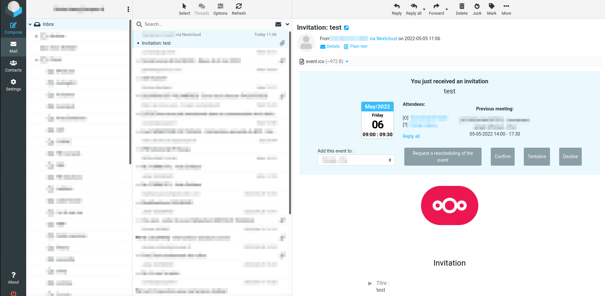
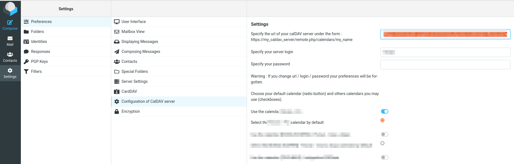

# RoundCube CalDAV - CalDAV calendar for Roundcube Webmail

Set a remote CalDav server and reply to your seetings invitation directly in Roundcube Mail

## Requirements

RoundCube CalDAV 1.0 requires at least PHP 7.0. Dependencies are managed by composer, if you are interested in a list, see the
[composer.json](composer.json) file.

The supported versions of roundcube and supported databases can be found in [SUPPORTED_ENVIRONMENT.md](doc/SUPPORTED_ENVIRONMENT.md).

## Installation

See [INSTALL.md](doc/INSTALL.md) for installation instructions.

## Translation 

The module is currently available in English and French.

## Documentation

A (hopefully growing) documentation for various topics is found in the [doc](doc/) folder.

